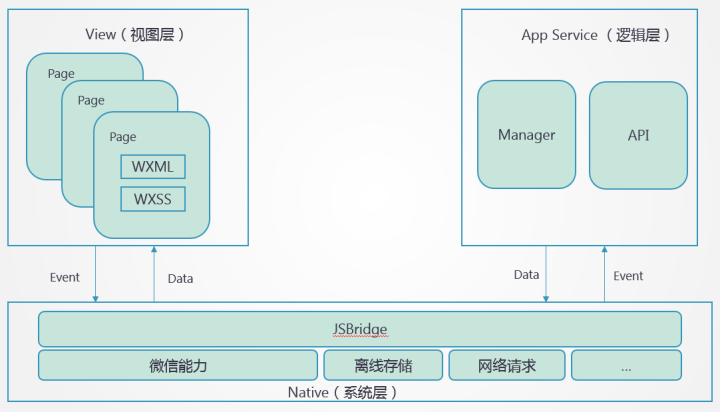
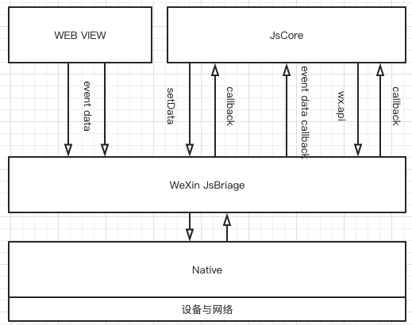
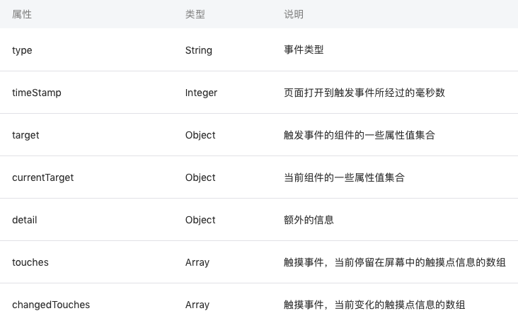
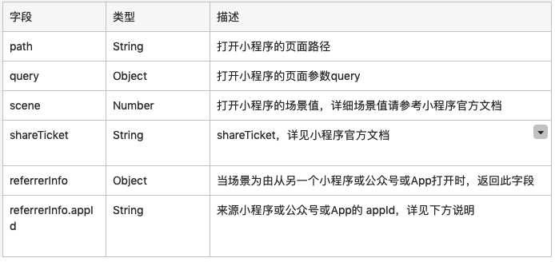

title: 小程序实践分享
speaker: jiazhen.ding

<slide class="bg-blue aligncenter" video="https://webslides.tv/static/videos/working.mp4 poster='https://webslides.tv/static/images/working.jpg' .light">

# 小程序实践分享 {.text-landing.text-shadow}

By jiazhen.ding {.text-intro}

[:fa-github: Github](https://github.com/wndershow/ppt/mp-share.md){.button.ghost}

<slide :class="aligncenter size-50">

### 分享主题

:::flexblock

## 特点

## 小程序的架构设计

## 工程化实践

## 认证授权

## 开发工具与 DEBUG

## 性能优化

---

## 引流有关

## 日志监控与数据分析

## 模板消息处理

## 状态管理

## 组件与插件

## API 有关

## 视图层

:::

<slide :class="size-50 aligncenter">
:::header
特性 -》 主题
:::

## 特性

即用即走，随手可得

<slide :class="aligncenter">
:::header
特性 -》 发展历程
:::

:::column

### JS-SDK

微信 JS-SDK 作为 WeixinJSBridge 的封装，使微信 H5 拥有了原生的一些能力。

---

### Web 离线存储

微信 web 离线存储加速文案，一定程度上降低了白屏的不良体验

---

### 小程序

主要解决了白屏问题和不流畅的用户体验，提供了更为丰富的原生 API。

<slide :class="aligncenter">

:::header
特性 -》 小程序与 PWA
:::

:::column

### 小程序

- 拥有离线能力

- 微信生态

- 媲美原生操作体验

- 将低了开发门槛，提高了开发效率高

---

### PWA

（App Manifest、Service Worker、Web Push）

- 兼顾 web app 和 native app 的优点

- 网络可靠性、可离线、消息推送

<slide :class="aligncenter">

:::header
特性 -》 适用场景
:::

#### 借助微信生态，引流辅助工具，快速实现 MVP。

<slide :class="size-50 aligncenter">

:::header
架构设计 -》 主题封面
:::

## 架构设计

<slide :class="aligncenter">
:::header
架构设计 -》 双线模型
:::

### 双线模型

渲染性能，更好的安全管控

:::column{.align-left}



HTTP OR SOCKET

---

- ##### 视图层

- webview 线程只负责UI渲染工作，把逻辑层撇开到单独的线程中，加快了UI渲染速度。

- 结合原来组件充分利用native的渲染，更好的提升了渲染性能。

- ##### 逻辑层

- iOS下的 JavaScriptCore 框架，安卓下腾讯 x5 内核的 JsCore。

- 通过提供一个沙箱环境来运行开发者的 JavaScript 代码来解决。

- ##### navtive层

- 视图、逻辑、网络间的数据通讯

<slide :class="aligncenter">

:::header
架构设计 -》 数据通讯
:::

### 数据通讯

天生延时

:::column{.align-left}



---

- 视图层通过宿主环境发送下事件数据到逻辑层。

- 逻辑层通过宿主环境发送数据到视图层。

- 逻辑层通过宿主环境调用native api。

- this.setData({...}, callback);

<slide :class="aligncenter">

:::header
架构设计 -》 事件
:::

### 事件

用户行为及组件状态反馈的抽象

<slide :class="aligncenter">

:::header
架构设计 -》 事件
:::

### 属性




<slide :class="aligncenter">

:::header
架构设计 -》 事件
:::

### 事件冒泡

:::column{.align-left}

```html
<view id="v3" bind:tap="handle3">
  <view id="v2" bind:tap="handle2">
    <view id="v1" bind:tap="handle1">click</view>
  </view>
</view>
```

---

handle1 -> handle2 -> handle3

<slide :class="aligncenter">

:::header
架构设计 -》 事件
:::

### catch 用于阻止事件冒泡

:::column{.align-left}


```html
<view id="v3" bind:tap="handle3">
  <view id="v2" catch:tap="handle2">
    <view id="v1" bind:tap="handle1">click</view>
  </view>
</view>
```

---

handle1 -> handle2


<slide :class="aligncenter">

:::header
架构设计 -》 事件
:::

### 捕获阶段

位于冒泡阶段之前，顺序与冒泡阶段恰好相反

:::column{.align-left}


```html
<view id="v2" bind:tap="handle4" capture-bind:tap="handle3">
  <view id="v1" bind:tap="handle1" capture-bind:tap="handle2">click</view>
</view>
```

---

handle3 -> handle2 -> handle1 -> handle4


<slide :class="aligncenter">

:::header
架构设计 -》 事件
:::

### target 与 currentTarget

:::column{.align-left}


```html
<view id="v2" bind:tap="handle1" >
  <view id="v1">click</view>
</view>
```

---

handle4 事件里的 target为v1


<slide :class="aligncenter">

:::header
架构设计 -》 事件
:::

### transitionend

过渡动画结束后会调用


<slide :class="aligncenter">

:::header
架构设计 -》 生命周期
:::

### 生命周期

:::column{.align-left}

```javascript
App({
  onLaunch(options) {
    console.info('App onLaunch', options);
  },
  onShow(options) {
    console.info('App onShow', options);
  },
  onHide() {
    console.info('App onHide');
  },
  onError(msg) {},
  globalData: {}
});

```

---

```javascript
Page({
  onLoad(options) {
    console.info('page index onLoad options包含了与些页面有关的参数', options);
  },
  onShow(options) {
    console.info('page index onShow 页面显示时调用，这里并没有options', options);
    console.info('page index all pages', getCurrentPages());
  },
  onReady() {
    console.info('page index onReady 页面没被销毁前只会触发1次，表示页面已经准备妥当，在逻辑层就可以和视图层进行交互了。');
  },
  onHide() {
    console.info('page index onHide 页面进入后台时调用');
  },
  onUnload() {
    console.info('page index onUnload 页面从页面栈移出前调用。');
  }
});
```


---

```javascript
Component({
  pageLifetimes() {
    show() {
      console.info('page show')
    },
    hide() {
      console.info('page hide')
    }
  }
});
```

<slide :class="aligncenter">

:::header
架构设计 -》 生命周期
:::

### app onLaunch 里option的参数




<slide :class="aligncenter">

:::header
架构设计 -》 生命周期
:::

### 跳转

- navigateTo

- redirectTo

- switchTab

- reLaunch


<slide :class="aligncenter">

:::header
架构设计 -》 生命周期
:::

### 实践性TIP

- 不要在 onLaunch 的时候调用 getCurrentPages()

- 始终注意着页面栈变化。

- tabbar 一旦加载即使在页面栈中移除也不会被销毁。

- 页面栈数量10

- setData() 次数和数据量尽可能小

- 入口页面把与请求有的东西放在onShow里

<slide :class="aligncenter">

:::header
架构设计 -》 生命周期
:::

### let {id} = getParams();

:::column{.align-left}

```javascript
export const getCurrentPage = () => {
  let pages = getCurrentPages();
  let currentPage = pages[pages.length - 1];
  return currentPage;
};

export const getParams = () => {
  let currentPage = getCurrentPage();
  let options = currentPage.options || {};
  return options;
};

```

---

- 因为page onShow里取不到。

- 你可能要在组件中获取页面参数。

- 因为小程序在navigate back来 back去的时候参数可能会错乱。


<slide :class="aligncenter">

:::header
架构设计 -》 tabbar方案
:::

### tabbar方案
建议设计时尽可能使用小程序默认配置方案

:::column{.align-left}

##### 使用配置项

- 体验流畅
- 外观具有很大的局限性
- 尺寸为 81px * 81px，偏差1px可能都会有很大程度上的失真。

---

##### 基础库 2.5.0 后的custom方案

- 外观可以自主定制，体验流畅
- 依然存在自定义mask无法查档tabbar问题

---

##### wx.hideTabBar(Object object)

- 用自定义组件方式实现tabbar
- 在tabbar page时调用wx.hideTabBar(Object object)把真实的隐藏掉
- 第一次点击时会有晃动的不良体验
