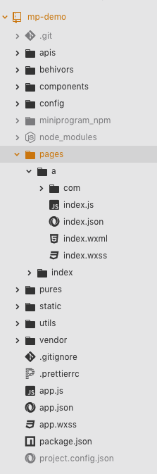
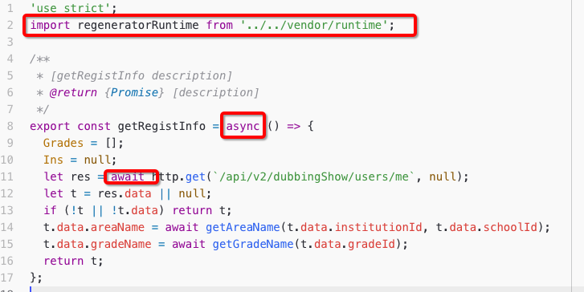
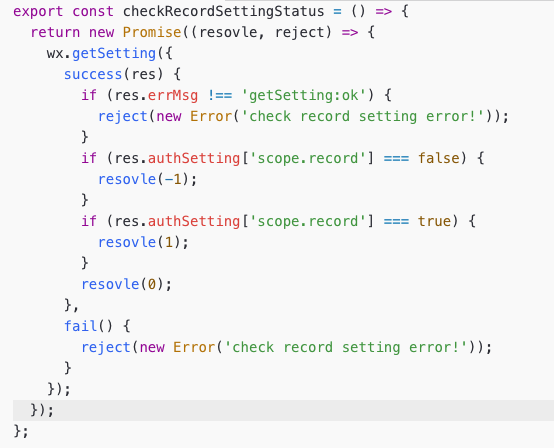
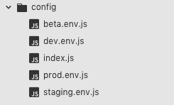
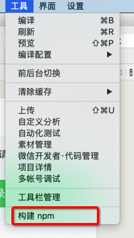
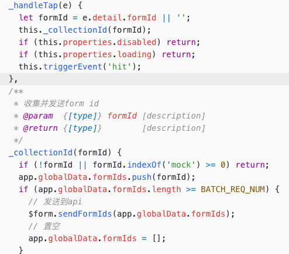
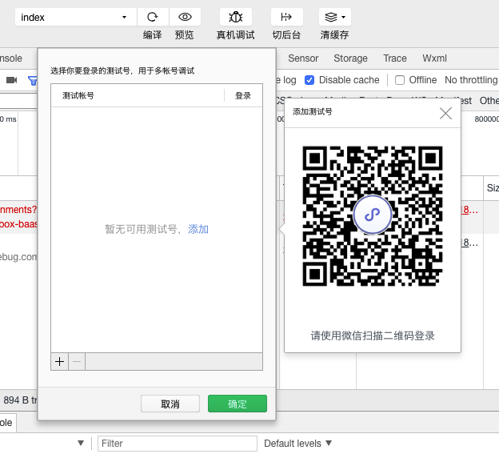
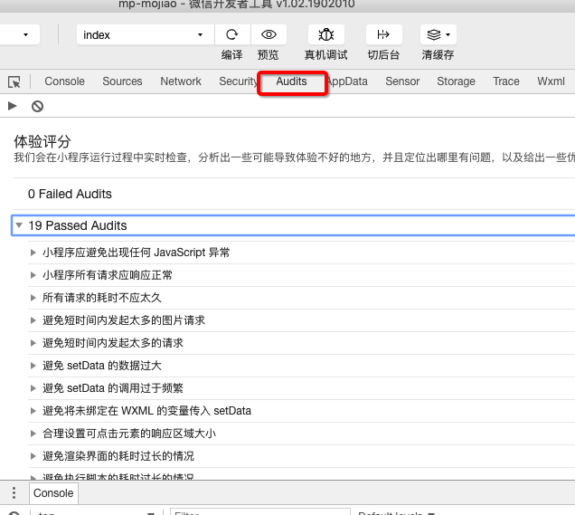
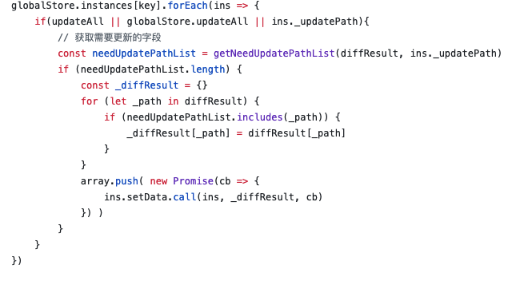
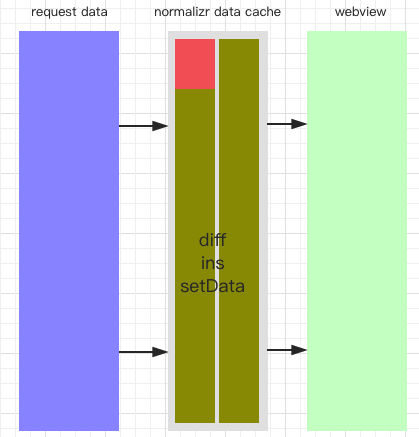

title: 小程序实践分享
speaker: jiazhen.ding

<slide class="bg-blue aligncenter" video="https://webslides.tv/static/videos/working.mp4 poster='https://webslides.tv/static/images/working.jpg' .light">

# 小程序实践分享 {.text-landing.text-shadow}

By jiazhen.ding {.text-intro}

[:fa-github: Github](https://github.com/wndershow/ppt/mp-share.md){.button.ghost}

<slide :class="aligncenter size-50">

### 分享主题

:::flexblock

## 架构设计

## 工程化实践

## 认证授权

## 性能优化

---

## 引流有关

## 模板消息处理

## 状态管理

## 开发工具

:::

<slide :class="size-50 aligncenter">
:::header
特性 -》 主题
:::

## 特性

即用即走，随手可得

<slide :class="aligncenter">
:::header
特性 -》 发展历程
:::

:::column

### JS-SDK

微信 JS-SDK 作为 WeixinJSBridge 的封装，使微信 H5 拥有了原生的一些能力。

---

### Web 离线存储

微信 web 离线存储加速方案，一定程度上降低了白屏的不良体验，但不能满足复杂页面。

---

### 小程序

主要解决了白屏问题和不流畅的用户体验，提供了更为丰富的原生 API。

<slide :class="aligncenter">

:::header
特性 -》 小程序与 PWA
:::

:::column

### 小程序

- 拥有离线能力

- 微信生态

- 媲美原生操作体验

- 将低了开发门槛，提高了开发效率高

---

### PWA

（App Manifest、Service Worker、Web Push）

- 兼顾 web app 和 native app 的优点

- 网络可靠性、可离线、消息推送

<slide :class="aligncenter">

:::header
特性 -》 适用场景
:::

#### 借助微信生态，引流辅助工具，快速实现 MVP。

<slide :class="size-50 aligncenter">

:::header
架构设计 -》 主题封面
:::

## 架构设计

<slide :class="aligncenter">
:::header
架构设计 -》 双线模型
:::

### 双线模型

渲染性能，更好的安全管控

:::column{.align-left}


HTTP OR SOCKET

---

- ##### 视图层

- webview 线程只负责 UI 渲染工作，把逻辑层撇开到单独的线程中，加快了 UI 渲染速度。

- 结合原来组件充分利用 native 的渲染，更好的提升了渲染性能。

- ##### 逻辑层

- iOS 下的 JavaScriptCore 框架，安卓下腾讯 x5 内核的 JsCore。

- 通过提供一个沙箱环境来运行开发者的 JavaScript。

- ##### navtive 层

- 视图、逻辑、网络及设备间的数据通讯

<slide :class="aligncenter">

:::header
架构设计 -》 数据通讯
:::

### 数据通讯

天生延时

:::column{.align-left}


---

- 视图层通过宿主环境发送事件数据到逻辑层。

- 逻辑层通过宿主环境发送数据到视图层。

- 逻辑层通过宿主环境调用 native api。

- this.setData({...}, callback);

<slide :class="aligncenter">

:::header
架构设计 -》 事件
:::

### 事件

用户行为及组件状态反馈的抽象

<slide :class="aligncenter">

:::header
架构设计 -》 事件
:::

### 属性


<slide :class="aligncenter">

:::header
架构设计 -》 事件
:::

### 事件冒泡

:::column{.align-left}

```html
<view id="v3" bind:tap="handle3">
  <view id="v2" bind:tap="handle2">
    <view id="v1" bind:tap="handle1">click</view>
  </view>
</view>
```

---

handle1 -> handle2 -> handle3

<slide :class="aligncenter">

:::header
架构设计 -》 事件
:::

### catch 用于阻止事件冒泡
没有e.stopPropagation

:::column{.align-left}

```html
<view id="v3" bind:tap="handle3">
  <view id="v2" catch:tap="handle2">
    <view id="v1" bind:tap="handle1">click</view>
  </view>
</view>
```

---

handle1 -> handle2

<slide :class="aligncenter">

:::header
架构设计 -》 事件
:::

### 捕获阶段

位于冒泡阶段之前，顺序与冒泡阶段恰好相反

:::column{.align-left}

```html
<view id="v2" bind:tap="handle4" capture-bind:tap="handle3">
  <view id="v1" bind:tap="handle1" capture-bind:tap="handle2">click</view>
</view>
```

---

handle3 -> handle2 -> handle1 -> handle4

<slide :class="aligncenter">

:::header
架构设计 -》 事件
:::

### target 与 currentTarget

:::column{.align-left}

```html
<view id="v2" bind:tap="handle1"> <view id="v1">click</view> </view>
```

---

handle4 事件里的 target 为 v1

<slide :class="aligncenter">

:::header
架构设计 -》 事件
:::

### transitionend

过渡动画结束后会调用

<slide :class="aligncenter">

:::header
架构设计 -》 生命周期
:::

### 生命周期

:::column{.align-left}

```javascript
App({
  onLaunch(options) {
    console.info("App onLaunch", options);
  },
  onShow(options) {
    console.info("App onShow", options);
  },
  onHide() {
    console.info("App onHide");
  },
  onError(msg) {},
  globalData: {}
});
```

---

```javascript
Page({
  onLoad(options) {
    console.info("page index onLoad options包含了与些页面有关的参数", options);
  },
  onShow(options) {
    console.info(
      "page index onShow 页面显示时调用，这里并没有options",
      options
    );
    console.info("page index all pages", getCurrentPages());
  },
  onReady() {
    console.info(
      "page index onReady 页面没被销毁前只会触发1次，表示页面已经准备妥当，在逻辑层就可以和视图层进行交互了。"
    );
  },
  onHide() {
    console.info("page index onHide 页面进入后台时调用");
  },
  onUnload() {
    console.info("page index onUnload 页面从页面栈移出前调用。");
  }
});
```

---

```javascript
Component({
  created() {
    // 这里可以给组件添加一些自定义属性，不好调用setData()
  },
  ready() {},
  pageLifetimes() {
    show() {
      console.info('page show')
    },
    hide() {
      console.info('page hide')
    }
  },
  lifetimes: {
    attached() { },
    moved() { },
    detached() { },
  },
});
```

<slide :class="aligncenter">

:::header
架构设计 -》 生命周期
:::

### app onLaunch 里 option 的参数


<slide :class="aligncenter">

:::header
架构设计 -》 生命周期
:::

### 跳转

- navigateTo

- redirectTo

- switchTab

- reLaunch

<slide :class="aligncenter">

:::header
架构设计 -》 生命周期
:::

### 实践性 TIP

- 不要在 onLaunch 的时候调用 getCurrentPages()

- wx.setNavigationBarTitle 写在 onReady 事件里

- 始终注意着页面栈变化。

- tabbar 一旦加载即使在页面栈中移除也不会被销毁。

- 页面栈数量 10

- setData() 次数和数据量尽可能小，数据限制 1024kb，与视图有关的放this当前组件里

- 入口页面把与请求有的东西放在 onShow 里
{.build}

<slide :class="aligncenter">

:::header
架构设计 -》 生命周期
:::

### let {id} = getParams();

:::column{.align-left}

```javascript
export const getCurrentPage = () => {
  let pages = getCurrentPages();
  let currentPage = pages[pages.length - 1];
  return currentPage;
};

export const getParams = () => {
  let currentPage = getCurrentPage();
  let options = currentPage.options || {};
  return options;
};
```

---

- 因为 page onShow 里取不到。

- 你可能要在组件中获取页面参数。

- 因为小程序在 navigate back 来 back 去的时候参数可能会错乱。

<slide :class="aligncenter">

:::header
架构设计 -》 运行更新机制
:::

### 冷启动与热启动

- 冷启动：是用户首次打开或小程序被微信主动销毁后再次打开的情况
- 热启动：后台态的小程序切换到前台
- 热启动所有状态都会保留

<slide :class="aligncenter">

:::header
架构设计 -》 运行更新机制
:::

### 运行时销毁时机

- 后台 5 分钟会被系统销毁
- 5 秒间隔内连续收到两次及以上系统内存告警时

<slide :class="aligncenter">

:::header
架构设计 -》 运行更新机制
:::

### 更新机制

小程序在冷启动时会检查更新，并异步下载代码包

- 体验版测试时退下微信进程。
- 可以使用 wx.getUpdateManager API 进行处理。

<slide :class="aligncenter">

:::header
架构设计 -》 组件
:::

### 组件

小程序里组件是 page 的赶集，可以把page定义为Component的形式

```javascript

# /pages/a/index.json
{
  "usingComponents": {}
}

# /pages/a/index.js
Component({

  properties: {
    paramA: Number,
    paramB: String,
  },

  methods: {
    onLoad() {
      this.data.paramA // 页面参数 paramA 的值
      this.data.paramB // 页面参数 paramB 的值
    }
  }

})

```

-

<slide :class="aligncenter" data-transition="newspaper">

:::header
架构设计 -》 组件
:::

### 组件间通讯方式

- 属性值传递
- 事件系统
- selectComponent
- relations
- slot
{.build}

<slide :class="aligncenter" data-transition="slide3">

:::header
架构设计 -》 组件
:::

### 数据的监听

```javascript
Component({
  observers: {
    "firstName, lastName": function(fn, ln) {
      this.setData({
        fullName: fn + ln
      });
    }
  }
});
```

<slide :class="aligncenter">

:::header
架构设计 -》 组件
:::

### 小程序里的 mixin, 组件 behaviors

:::column

```javascript
module.exports = Behavior({
  behaviors: [],
  properties: {
    myBehaviorProperty: {
      type: String
    }
  },
  data: {
    myBehaviorData: {}
  },
  attached() {},
  methods: {
    myBehaviorMethod() {}
  }
});
```

---

```javascript
const myBehavior = require("my-behavior");
Component({
  behaviors: [myBehavior],
  properties: {
    myProperty: {
      type: String
    }
  },
  data: {
    myData: {}
  },
  attached() {},
  methods: {
    myMethod() {}
  }
});
```

<slide :class="aligncenter">

:::header
架构设计 -》 组件
:::

### 计算属性

自定义组件扩展 definitionFilter，是提供了修改自定义组件定义段的能力

[:fa-home: Computed](https://github.com/wechat-miniprogram/computed){.button.ghost}

```javascript
const beh = require("./behavior.js");
Component({
  behaviors: [beh],
  data: {
    a: 0
  },
  computed: {
    b() {
      return this.data.a + 100;
    }
  },
  methods: {
    onTap() {
      this.setData({
        a: ++this.data.a
      });
    }
  }
});
```

<slide :class="aligncenter">

:::header
架构设计 -》 插件
:::

### 插件

可以是页面的组合，封装可复用的功能和服务

<slide :class="aligncenter">

:::header
架构设计 -》 rpx 单位
:::

### 相对单位 rpx

设计师以 iphone6 作为视觉稿的标准

<slide :class="aligncenter">

:::header
架构设计 -》 wxs
:::

### wxs

- 可用于高性能动效，数据过滤、修饰。

- 不能使用 es6 相关的东西。

<slide :class="aligncenter">

:::header
架构设计 -》 多线程
:::

### 多线程 worker

可以把结果返回到小程序主线程

<slide :class="aligncenter">

### 小程序工程化实践


<slide :class="aligncenter">

:::header
工程化实践 -》 开发目录结构
:::

### 开发目录结构

:::column



---

- page 组件化
- 中线风格命名
- 页面模块名index

<slide :class="aligncenter">

:::header
工程化实践 -》 框架选择
:::

### 框架选择
原生态的mina

- 完善的组件化方案
- 出了问题容易定位

<slide :class="aligncenter">

:::header
工程化实践 -》 异步处理方案
:::

### 异步处理方案





<slide :class="aligncenter">

:::header
工程化实践 -》 Promise.all
:::

### Promise.all

Promise.all([])

<slide :class="aligncenter">
:::header
工程化实践 -》 代码格式化方案
:::

### 代码格式化方案
代码保存的时候格式化

- .prettier
- 编辑器prettier插件


<slide :class="aligncenter">
:::header
工程化实践 -》 多环境方案
:::

### 多环境方案
每个环境一套配置




<slide :class="aligncenter">

:::header
工程化实践 -》 tabbar 方案
:::

### tabbar 方案

建议设计时尽可能使用小程序默认配置方案。

:::column{.align-left}

##### 使用配置项

- 体验流畅
- 外观具有很大的局限性
- 尺寸为 81px \* 81px，偏差 1px 可能都会有很大程度上的失真。

---

##### 基础库 2.5.0 后的 custom 方案

- 外观可以自主定制，体验流畅
- 依然存在自定义 mask 无法查档 tabbar 问题

---

##### wx.hideTabBar(Object object)

- 用自定义组件方式实现 tabbar
- 在 tabbar page 时调用 wx.hideTabBar(Object object)把真实的隐藏掉
- 第一次点击时会有晃动的不良体验


<slide :class="aligncenter">

:::header
工程化实践 -》 返回首页
:::

### 返回首页方案
群消息卡片里进入小程序，如何返回首页

- 自定义导航栏
- 先进入index，从index跳转到相当页面

<slide :class="aligncenter">
:::header
工程化实践 -》 js 生态
:::

### js 生态
通过npm构建小范围使用

- npm i dayjs -s
- 


<slide :class="aligncenter">
:::header
工程化实践 -》 样式方案
:::

### 样式方案
定义设计标准，间距、大小、颜色

<slide :class="aligncenter">
:::header
工程化实践 -》 样式方案
:::

### 原子类组合 + 组件化

[tachyons](https://github.com/tachyons-css/tachyons)

```html
<view class="flex br ba gray shawdow">
  <view class="pl3"></view>
  <view class="flex-auto"></view>
</view>
```

[ColorUI](https://github.com/weilanwl/ColorUI)

<slide :class="aligncenter">
:::header
工程化实践 -》 样式方案
:::

### base64技巧

- iconfont字体图标
- 背景图

<slide :class="aligncenter">
:::header
工程化实践 -》 样式方案
:::

### textarea穿透


<slide :class="aligncenter">
:::header
工程化实践 -》 样式方案
:::

### 如何使用less
不使用

- 样式域
- 原子类（变量）

<slide :class="aligncenter">
:::header
工程化实践 -》 样式方案
:::

### 动效交互

- wx.createIntersectionObserver 相并监听
- ripples.wxss
- [拖动排序](https://github.com/kevenfeng/DragSort)


<slide :class="aligncenter">
:::header
工程化实践 -》 样式方案
:::

### 高清适配

```css
media only screen and (-webkit-min-device-pixel-ratio:2)
media only screen and (-webkit-min-device-pixel-ratio:3)
```

<slide :class="aligncenter">
:::header
工程化实践 -》 API对接
:::

### API联调方案
服务端尽可能使用graphql服务

- 并发限制

<slide :class="aligncenter">
:::header
工程化实践 -》 发布与持续集成方案
:::

### 发布与持续集成
开发者工具的接口能力（命令行上传代码）

- 命令行启动工具、登录、提交预览、上传代码、自动化测试
- 小程序可以设置不向后兼容 wx.getSystemInfoSync，wx.canIUse

<slide :class="aligncenter">
### 引流
更好的利用微信生态


<slide :class="aligncenter">
:::header
引流 -》 转发
:::

### 群信息

- wx.showShareMenu --- withShareTicket: true
- shareTicket app的 onLaunch onShow里获得
- wx.getShareInfo(shareTicket) 获取群信息
- 注意参数

<slide :class="aligncenter">
:::header
引流 -》 跳转
:::

### 跳转

##### 小程序到h5 (webview)
- 只能在小程序内通过webview全屏打开
- 需要到小程序管理后台做相应配置

##### 小程序跳转到小程序
- wx.navigateMiniProgram(OBJECT) 跳转到
- wx.navigateBackMiniProgram(OBJECT) 跳转回
- 需要到小程序管理后台做相应配置

##### h5到小程序（jssdk）
- wx.miniProgram.navigateTo
- wx.miniProgram.redirectTo
- wx.miniProgram.reLaunch

##### 公众号跳转到小程序
- 公众号菜单
- 公众号模板消息
- 公众号小程序绑定通知

##### 打开app
- 只能调回app

<slide :class="aligncenter">
:::header
引流 -》 生成分享图
:::

### 生成分享图

- drawImage 时 使用本地路径，wx.getImageInfo。
- 用remSize作适配
- arc clip 绘制带边框的圆形头像
- wx.createCanvasContext，在非page组件使用时注意传this
- catchtouchmove='preventTouchMove’

<slide :class="aligncenter">
### 模板消息机制

<slide :class="aligncenter">
:::header
模板消息机制 -》 button样式重置
:::
### form-btn

:::column

```css
button{
  background-color:transparent;
  padding:0;
  margin:0;
  display:block;
  border:0;
  border-radius:0;
  z-index: 10;
}
button::after{
  content:'';
  width:0;
  height:0;
  -webkit-transform:scale(1);
  transform:scale(1);
  display:none;
  background-color:transparent;
}
```

---



<slide :class="aligncenter">
### 性能优化

<slide :class="aligncenter">
:::header
性能优化 -》 常规优化
:::

### 常规优化

- setData 次少，量少，与视图无关的状态数据保存于当前组件
- 骨架图
- 缓存数据
- 分包优化首次打开时的速度
- 注意setTimeout setInterval 在页面转场后的清理
- 事件处理时组件的data放入尽可能少的数据
- 尽量避免页面里定义onPageScroll，注意防抖
{.build}

<slide :class="aligncenter">
:::header
性能优化 -》 长列表
:::
### 长列表

[recycle-view](https://github.com/wechat-miniprogram/recycle-view)

计算只需要渲染的数据，不需要渲染的留空

<slide :class="aligncenter">
:::header
性能优化 -》 预加载
:::
### 页预加载方案

- 封装navigate组件 主动加载
- 模拟setData 先暂存再设置

<slide :class="aligncenter">
### 开发者工具


<slide :class="aligncenter">
:::header
开发者工具 -》 多账号调试
:::

### 多账号调试



<slide :class="aligncenter">
:::header
开发者工具 -》 调优面板
:::

### 调优面板



<slide :class="aligncenter">
### 认证授权

<slide :class="aligncenter">
:::header
认证授权 -》 认证流程
:::

### 认证流程

- 用户访问入口
- 调用业务接口
- 业务接口返回401
- wx.request拦截到401状态转向到auth page
- auth page里进入登录确认用户身份
- auth page认证成功后跳转到入口页
- 入口业访问业务接口获取业务数据
{.build}

<slide :class="aligncenter">
:::header
认证授权 -》 二次授权
:::

### 二次授权
wx.createRecordContext

wx.getRecorderManager

wx.openSetting


<slide :class="aligncenter">
### 状态管理

<slide :class="aligncenter">
:::header
状态管理 -》 westore
:::

### westore
[westore状态管理工具](https://github.com/Tencent/westore)，进阶版 [omix](https://github.com/Tencent/omi/tree/master/packages/omix)




<slide :class="aligncenter">
:::header
状态管理 -》 wx.request
:::

### wx.request + graphql
把80% 的领域模型数据，标准化到本地缓存.



<slide :class="aligncenter">
### 学习方法

<slide :class="aligncenter">
:::header
学习方法
:::

### 学习方法
没有比官方文档更好的学习途径
